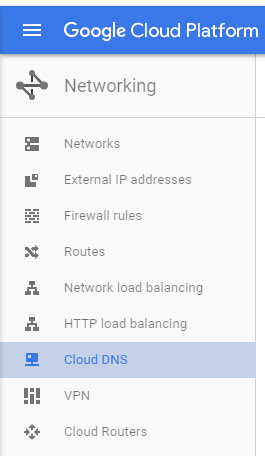

## Objective

We are going to use Google Cloud and Google Domains to create a WordPress powered .io ending website in the cloud.  
We will be utilizing Google Cloud Compute Engine’s Click To Deploy WordPress package. A working knowledge of DNS is
not required but recommended. Estimated time to complete is about 45 minutes.

## Why Google Cloud?

One of the main benefits of leveraging a cloud provider for hosting is that you can pay monthly. Hosting through a
more traditional vendor usually requires a 1 year buy-in for a Hosting Server. Additionally, if later down the road
you discover you need a larger machine you can scale up your box with minimal effort. Currently, Google Cloud is running
a free 60 day \$300 promotion which makes it a great low risk testing ground. And lastly, the nerd factor. Who doesn’t like
boasting about their cloud powered site?

## Why use Google Domains?

The key selling point here is quick integration into Google Apps for Work which is great for setting up quick email accounts.
Right now Domains is in beta so it isn’t feature rich but there is hope for further integration down the road.

## Create Domain

Go to Google Domains and create a domain

## Create New Google Cloud Project

We will be leveraging one of compute engine’s deploy images. This is in essence a preconfigured virtual machine running the
Debian distro of Linux on Apache, serviced by MySQL. Click the following link to navigate to the deploy image and click
the launch button.

[WordPress Click To Deploy Image](https://console.cloud.google.com/marketplace/details/click-to-deploy-images/wordpress?pli=1)

After you click launch you will be prompted to create a project to house your new Google Cloud Compute Engine VM.
I elected to name mine the same as my web address. Use your own discretion, the name does not matter.

Following the create, if you are new to Google Cloud you will be prompted to fill out the signup form for Google Cloud.
This is a no risk signup as you can cancel anytime within the first 60 days for a refund
[assuming you don’t burn through the $300 limit].

Once you have created your project you are ready for setup. It is important to note that the particular Compute Engine
image we have selected is a little beefier than some of the other options available. This is in part because the other
two offerings from Bitnami run on shared load micro instances. Sure they’re $5 a month and our instance is $25.95 but
for \$25.95 you get a dedicated VM and 100% uptime. You get what you pay for, and in this instance we aren’t paying for
anything for 2 months. So why not enjoy a little more speed. You can always downgrade to a micro instance later on if
you decide you do not need the full power.

Make sure to fill out an administrator email, check the install phpMyAdmin option and begin the deployment.
Once deployment has completed you will be able to browse to your new WordPress project from the supplied IP.
Take note of the admin password as well as the MySQL password provided.

## Setup Domain

Note what name servers your domain is actively using. Now go back to google cloud and click on networking

Then on Cloud DNS

Create a new zone in the same region as your google domain. The Zone name can be anything you want.
Make the DNS Name the name of your domain.

More than likely you will notice that the assigned domain servers do not match those on your google domains account.

If this is the case, click the pencil for both the NS and SOA record and update the domain servers to match in
both the NS and SOA record

You will also need to add 2 more record sets. An A record and a CNAME record. Use the IP address for your newly
created WordPress site as the A record and use the domain name for your CNAME record

Now we need to update our Google Domains account to match. Go back to Google Domains, click on DNS, scroll to the
bottom of the page and enter 2 new records.

_It’s important to note that I have used an A record for the WWW assignment. This would normally be done as a CNAME record but Google Domains does not support CNAME entry for .io domains._

One of the main benefits of hosting through Google is that Domain propagation is \***\*FAST\*\***. More than likely your domain
will be attached to the IP you have assigned by the time you have finished reading this. If not, don’t sweat it.
It should come through shortly. In the exceptional case, full propagation will occur within 24-48 hours. But it’s
been my experience that when hosting with Google, most domain changes are nearly instant, which is convenient.

Once propagation has completed and you are able to visit your site from both the domain and the WWW domain variant it is
time to make the new blog aware of it’s domain. Go to the IP address specified and login to the WordPress Admin site with the
credentials you were given at the cloud launcher completion.

In my case that would be. Yours will be different

http://104.197.56.111/wp-admin

Go to the settings tab and update both the WordPress URL and site URL to match your domain.

Save and you are done. You have just setup a WordPress site in the cloud. Sit back, relax, crack a brew and brag about how awesome you are.
