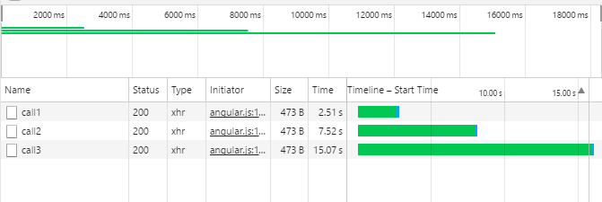
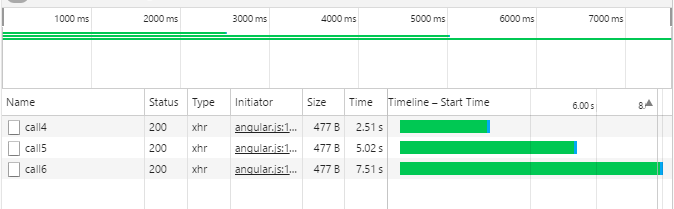

A copy of my demo application can be found on [GitHub](https://github.com/jongear/aspnet-mvc-blocking-ajax-example)

Last week one of my colleagues noticed some strange behavior in our MVC layer
that was causing otherwise asynchronous AJAX calls to run synchronously. At first
observation we assumed it must be a bug in how our MVC layer is communicating with
our API layer or that the Angular \$http service is routing requests synchronously.
This assumption came in part due to observing asynchronous call retrieval in some
areas of our site but not in all areas.

After further digging it was found that this assumption was incorrect. The culprit
lied in our use of Session variables. When you use session variables MVC will take
all concurrent requests from a user and make them synchronous to ensure that session
variable data integrity is preserved.


<p style="text-align: center;">
  _[ASP.NET Session State
  Overview](https://docs.microsoft.com/en-us/previous-versions/ms178581(v=vs.140))_
</p>

The article states that if we apply the following ReadOnly flag to any controller that
is not changing Session variables we will be able to continue to make concurrent requests.
As a request for the read-only session information does not result in an exclusive lock on the session data.

```csharp
[SessionState(System.Web.SessionState.SessionStateBehavior.ReadOnly)]
public class MyAjaxController : Controller
{
    // Async methods here
}
```

To proof this I made a [demo application](https://github.com/jongear/aspnet-mvc-blocking-ajax-example)
that essentially loads data into session.

```csharp
public class HomeController : Controller
{
   // GET: Home
   public ActionResult Index()
   {
       Session[“TestVariable”] = “Testing hydrating a session variable”;
       return View();
   }
}
```

I then made two controllers. One that utilizes the ReadOnly technique and one that does not.

Here are the network results from the controller calls that do not utilize the ReadOnly tag.



And here is the test code

```csharp
public class BlockingAjaxController : Controller
{
    public JsonResult Call1()
    {
        System.Threading.Thread.Sleep(2500);
        return Json(true, JsonRequestBehavior.AllowGet);
    }
    public JsonResult Call2()
    {
        System.Threading.Thread.Sleep(5000);
        return Json(true, JsonRequestBehavior.AllowGet);
    }
    public JsonResult Call3()
    {
        System.Threading.Thread.Sleep(7500);
        return Json(true, JsonRequestBehavior.AllowGet);
    }
}
```

I attempted the same test with my other test controller that has the ReadOnly attribute attached.



And here is the test code

```csharp
[SessionState(System.Web.SessionState.SessionStateBehavior.ReadOnly)]
public class NonBlockingAjaxController : Controller
{
    public JsonResult Call4()
    {
        System.Threading.Thread.Sleep(2500);
        return Json(true, JsonRequestBehavior.AllowGet);
    }
    public JsonResult Call5()
    {
        System.Threading.Thread.Sleep(5000);
        return Json(true, JsonRequestBehavior.AllowGet);
    }
    public JsonResult Call6()
    {
        System.Threading.Thread.Sleep(7500);
        return Json(true, JsonRequestBehavior.AllowGet);
    }
}
```

Both controllers have the same logic however the NonBlockingAjaxController will consistently finish
it’s workload in half the time of the BlockingAjaxController as a request for the read-only session
information does not result in an exclusive lock on the session data. I hope this helps identify why
your AJAX calls may not have been behaving in the way you expected them to.
