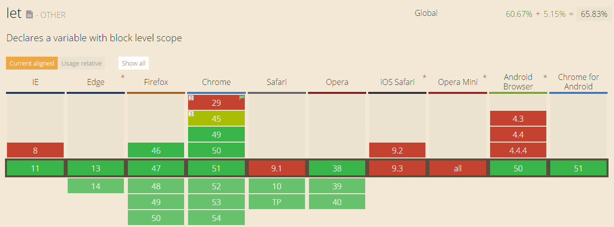

You’ve seen let and var used and for the most part they appear to be interchangeable
but what exactly is the difference between let and var? The simplest explanation of the
difference between let and var is that let is bound by block scope while var is bound
by function scope.

Consider the following function scoped example. In this scenario let and var act the
same since they share the same scope.

```javascript
new (function() {
  var a = 123;
  let b = 456;

  console.log(a); //123
  console.log(b); //456
})();
```

The following example highlights the scoping difference between let and var. Unlike C# and
other languages, when you declare a var in for loop scope that variable continues to exist
in following lines. Using let ensures that the scope of the variable is limited purely to
the for loop logic block. Attempting to reference a let variable outside of it’s declarative
block leads to a runtime exception

```javascript
new (function() {
  for (var x = 0; x < 10; x++) {
    //do work
  }
  console.log(x); // 10

  for (let y = 0; y < 10; y++) {
    //do work
  }
  console.log(y); //Uncaught ReferenceError: y is not defined
})();
```

The following scenario involves bounding variables in blocks. This has the same result as the
looping example.

```javascript
new (function() {
  {
    var x = 5;
  }
  console.log(x); //5

  {
    let y = 6;
  }
  console.log(y); //Uncaught ReferenceError: y is not defined
})();
```

As we can see, let can be a great asset for encapsulating code. As always, before using ES6 features
make sure that your environment supports them. [Can I Use Let?](https://caniuse.com/#search=let)


