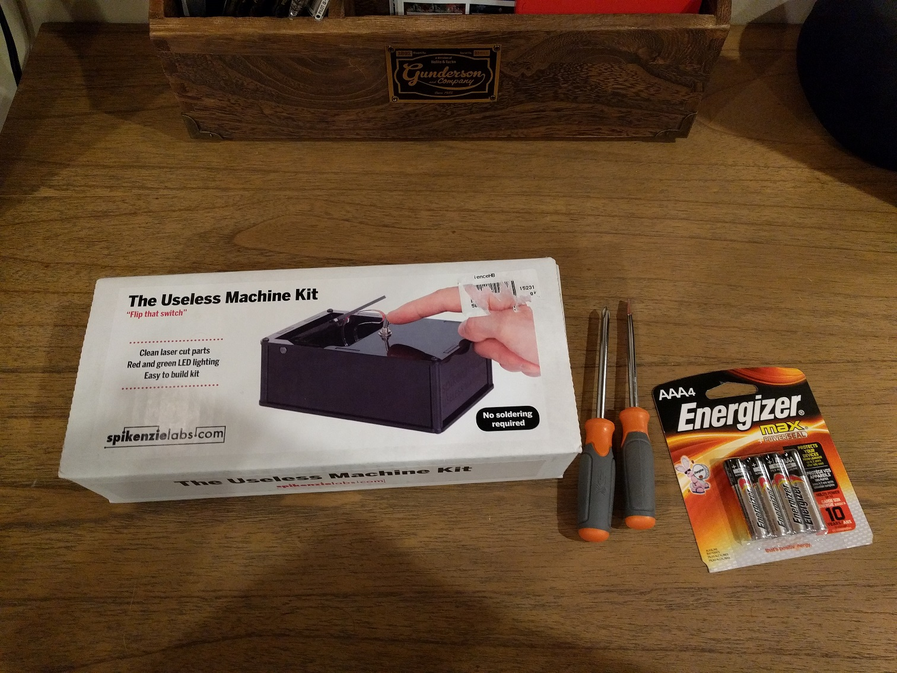
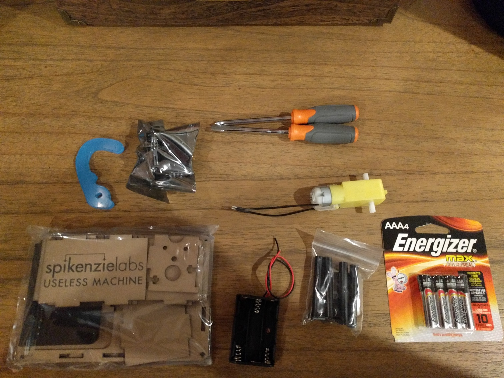
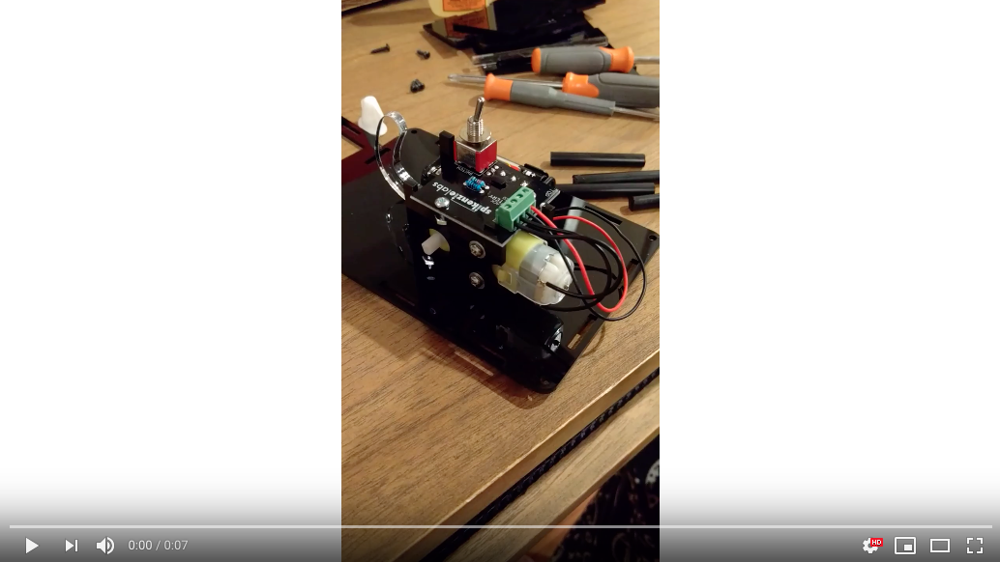
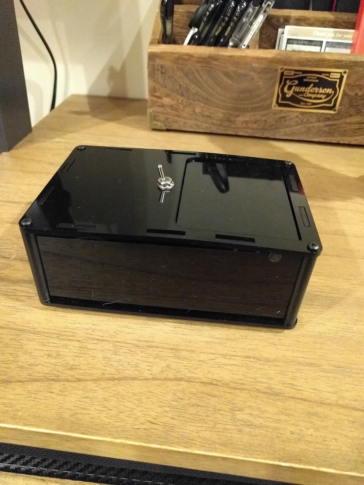
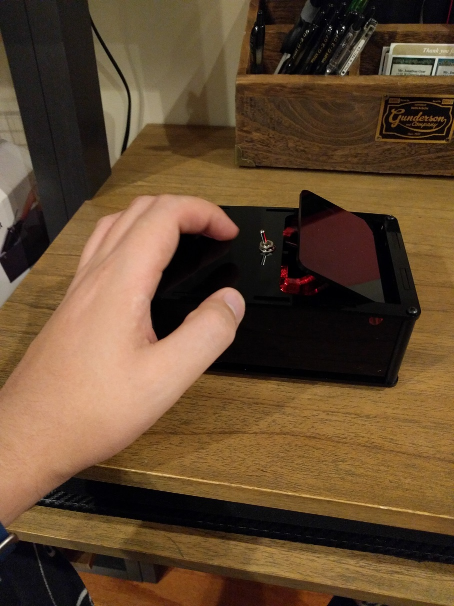

The other day I found myself in MicroCenter which if you haven’t been before I recommend checking one out.
They are an interesting cross between a chain computer store and a post-apocalyptic warehouse of robotic parts,
but I digress. In my quest to find a new RFID shield for my Arduino unit I ran across a product by SpikenzieLabs
called the Useless Machine kit.

As a serial tinker, I found this product rather entertaining. The best part of the kit is it only requires a screwdriver,
some batteries, and a little patience.

_The kit comes with acrylic body plates, a servo, battery compartment, assembled circuit board and screws_

Overall I enjoyed the kit. One gotcha in the process surrounds the poles used to support the top of the casing for the
machine. SpikenzieLabs did not drill pilot holes and the poles are very slippery. I was able to drill holes by wrapping
a rubber band around the pole for traction and using an electric drill to drill in my screws, which was a somewhat
frustrating experience. It’s also important to note that my box top does not lay flush with the rest of the kit walls.
finOther than this cosmetic blemish it does behave as intended and is rather amusing to play with.

_Lid does not lay flush with the rest of the kit_

For 35 bucks SpikenzieLabs useless machine kit does provide an entertaining hour of tinkering and could definitely be fun for
parents to work through with their children. Just watch out for those poles! My thumb is still red from trying to muscle the screws into them.
