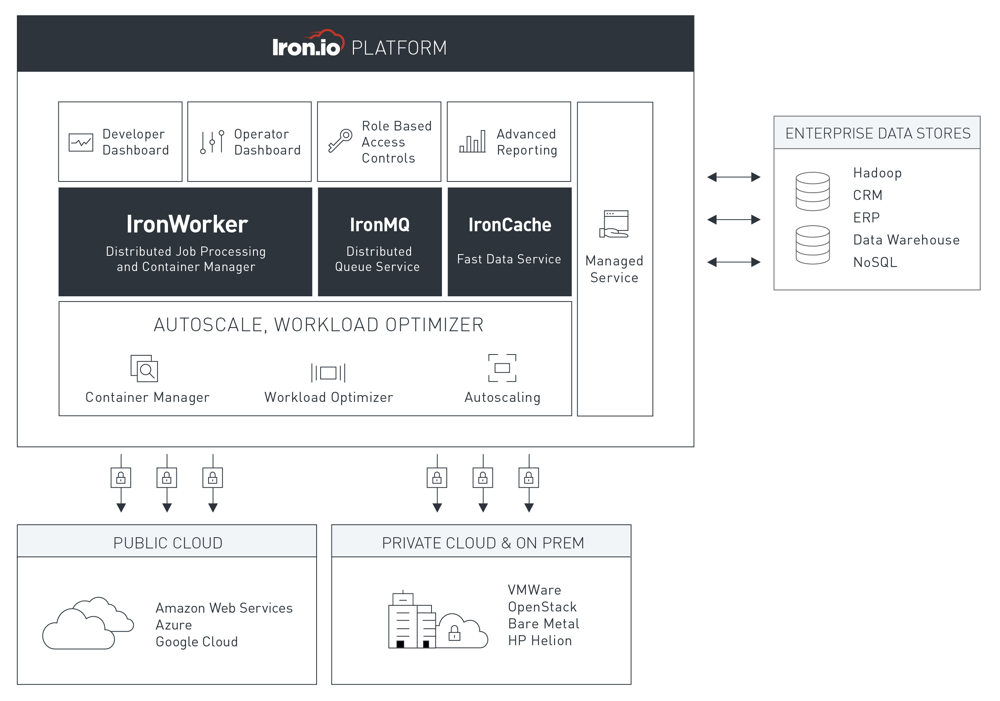
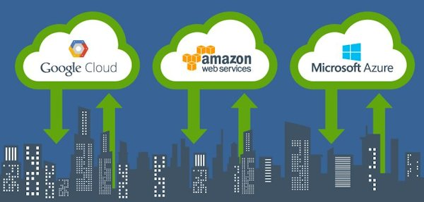

import slsDashboardImg from './assets/serverless-dashboard.gif';

Serverless Computing has steadily picked up steam since AWS released Lambda in 2014.
Serverless Computing or FaaS (Function as a Service) is a subsector of cloud computing that
enables the automated execution of Unit of Work sized codebases. In Serverless Computing the host
environment manages the starting, stopping, integration, scaling, and billing of the acted upon codebase.
This allows developers to focus on what their code does while cloud providers can focus on how.

## Use Cases

### Serverless Website

This is the concept of running full websites without managing any of the interrelated servers.
In AWS this is typically accomplished by uploading a static website to S3 that contains local routing
technology seen in Angular, React or Aurelia. Lambdas are then connected to API Gateway to drive web requests
and a DynamoDB or RDS backend is used to persist data.

### Task Schedulers

In AWS you can set a CloudWatch event to trigger at your desired frequency to act upon a resource. This has
been successfully mapped over as a workflow for task scheduling. Have the CloudWatch event fire a Lambda and
you can now kiss your ugly 1am EC2 Windows Task goodbye.

### Image Processing

Perhaps one of the most interesting use cases for Serverless computing is for Facial Recognition and other
image processing based tasks such as thumbnail generation.

### Where do I start?

As always, start small. Isolate a process in your system that is out of date, a pain to manage and small in
scope. My personal favorite starting point is moving business related task triggers to a Serverless environment.
If the task is small enough in scope move the entire job to a Serverless Function if not, that’s ok. Try exposing
an API endpoint for your Lambda to call as a first step or have your Serverless Function send out a message that
the job will be listening for.

## Frameworks

### [Serverless](https://serverless.com/)

Originally known as JAWS before rebranding, recently hit version 1.10 and currently supports Azure, AWS and
Google Cloud. Serverless supports Node.js on all platforms and attempts to work as “close to the metal” as
possible to provide a clean API. They also offer a dashboard for ease of deploy, logging and stack rollout.

### [IronFunctions](https://www.iron.io/)

Leverages Docker as an abstraction layer between user codebases and the acted upon environment. This offers
a more user friendly approach to jumping into Servereless development.

## Serverless Computing providers

### [AWS – Lambda](https://aws.amazon.com/lambda/)

|                          |                           |
| ------------------------ | ------------------------- |
| **Supported Languages:** | Node.js, Python, Java, C# |
| **Max Runtime:**         | 5 Minutes                 |
| **Max Memory:**          | 1,536MB                   |

### [Azure – Functions](https://azure.microsoft.com/en-us/services/functions/)

|                          |                                                           |
| ------------------------ | --------------------------------------------------------- |
| **Supported Languages:** | Node.js, C#, F#, Python, PHP, Bash, Batch, and PowerShell |
| **Max Runtime:**         | 5 Minutes                                                 |
| **Max Memory:**          | 1,536MB                                                   |

### [Google Cloud – Functions](https://cloud.google.com/functions/)

|                          |                                                           |
| ------------------------ | --------------------------------------------------------- |
| **Supported Languages:** | Node.js, C#, F#, Python, PHP, Bash, Batch, and PowerShell |
| **Max Runtime:**         | 5 Minutes                                                 |
| **Max Memory:**          | 1,536MB                                                   |
